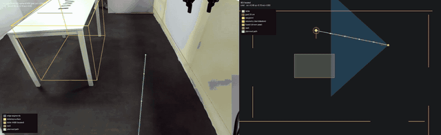
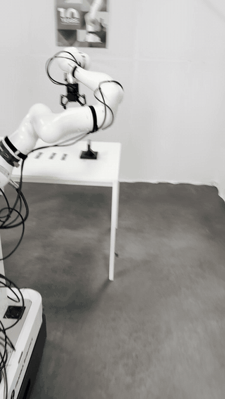

# EBiM Task 2 Real-Robot Submission — Team Camelo

Team **Camelo**'s submission for **EBiM Task 2** — *"Pick up the thermal pad
and place it on the target RAM board"* — run on the real robot at the Munich
rig: a mobile dual-Franka-FR3 "TMR" base, ZED-M head camera, two RealSense
D405 wrist cameras. An **ACT** policy checkpoint
([`ostjul/camelo-ebim-task2-act-s27a15`](https://huggingface.co/ostjul/camelo-ebim-task2-act-s27a15))
is served from a remote GPU box; an **executor** runs natively on the station
laptop and drives the arms at 20 Hz; a **perception-based base
approach** can drive the base to the table first, or the base is parked by hand. This README is the manual for running that
setup exactly as it was run in Munich. The terminal-by-terminal procedure is
[`docs/CHEATSHEET.md`](docs/CHEATSHEET.md). Read [Status](#status) before running anything on hardware.

Image: `ghcr.io/ostjul/camelo-ebim-task2-phase2-submission:v0.1.0` · Release `v0.1.0` — 2026-09-09 (build `db22206`).

## How it runs

Three machines, one data path. The policy never runs on the station or the
companion; the executor never runs anywhere else.

```
    GPU BOX                          STATION LAPTOP                        COMPANION
   ---------                        ----------------                      -----------
   docker container                 native pixi Humble env                arm controllers
   ACT policy server        SSH     executor: scripts/run_policy.py       (joint_impedance_
   ws://0.0.0.0:8767  <===========> --backend remote, 20 Hz control  <==> controller per arm)
                       tunnel        loop                                  gripper clients
                     -L 8767:       DDS graph: domain 0, camelo's          cameras (ZED head,
                   127.0.0.1:8767   own Fast DDS profile                    two D405 wrists)
```

The executor runs natively on the station, never in a container: a container
participant on the station's own DDS graph correlates with whole-station
kernel OOM events (rule C-3), so only a native pixi process may publish onto
it. The GPU box is reached only through the SSH tunnel; port 8767 stays
closed to the internet.

**A session, end to end** (each step links to its block in the cheat sheet):

1. [Start the policy server](docs/CHEATSHEET.md#policy-server-g) **(G)** — the ACT checkpoint in the released image.
2. [Install the executor on the station](docs/CHEATSHEET.md#install-on-the-station-p-once) **(P, once)** — clone, pixi shell, editable install, camelo's own DDS profile.
3. [Bring up the robot](docs/CHEATSHEET.md#phase-0-bring-up-ack) **(A/C/K)** — clock sync, arm/gripper stack, cameras, the four numbers (`4 0 2 1`; the first may be 5 or 6 with other controllers up).
4. [Home the arms and place the scene](docs/CHEATSHEET.md#arms-and-scene-apm) **(A/P/M)** — home pose, base/table overlay, pad row, spine height, camera contract.
5. [Connect the station to the server](docs/CHEATSHEET.md#tunnel-and-dummy-client-tp) **(T/P)** — the tunnel, then the dummy client before **every** rollout.
6. [Run the policy](docs/CHEATSHEET.md#rollout-p) **(P)** — the base either driven by the perception approach or parked by hand and aligned with the overlay, then the manipulation rollout line, the after-rollout check, the pass table, scoring.
7. [Optional: drive the base](docs/CHEATSHEET.md#optional-base-approach-p) **(P)** — off by default; needs two operator measurements first.
8. [Wind-down](docs/CHEATSHEET.md#wind-down-a) **(A)** — cameras and tunnel first, arms down last.

## Prerequisites

**GPU box**

- Docker with the NVIDIA container runtime (`--gpus all` must work) and a
  driver **R570 or newer**: the image's torch wheels are CUDA 12.8 builds.
- Reachable by SSH from the station.

**Station (ebimHP)**

- The pixi-managed ROS 2 Humble station environment at
  `~/teleoperation/station`. To rebuild it on a fresh laptop:
  [`site/station/pixi.toml`](site/station/pixi.toml) and
  [`site/station/configs/tmr_laptop_env.sh`](site/station/configs/tmr_laptop_env.sh).
- This repository cloned at `~/camelo/camelo-ebim`; python deps `numpy`,
  `pyyaml`, `msgpack`, `websockets`, `pillow`, `cv2` (checked in step 2).

**Companion (the robot's Jetson)**

- The site bring-up scripts in its home directory: `start_upper.bash`,
  `start_base.bash`, `home_arms.py`, the home-pose YAMLs, and the station's
  `configs/sync_robot_clock.sh`. Verbatim snapshots ship under
  [`site/companion/`](site/companion/) and [`site/station/`](site/station/)
  so they can be copied onto a machine that lacks them; the cheat sheet links
  the right file at each step.

**Terminal legend.** **M** = your Mac/workstation, **A** = companion
(`ssh companion` from the station, arm/gripper/base stack), **C** = second
companion login, **T** = station tunnel, **P** =
station pixi shell (everything camelo), **K** = station camera launcher,
**G** = the GPU box.

## Quick run

The blocks that make the remote policy move the arm. Everything between
them (scene placement, checks, scoring, wind-down) is in the
[cheat sheet](docs/CHEATSHEET.md); do not skip it on hardware.

**G — start the ACT policy server.**
```bash
docker compose up policy-server
```
One service, `ghcr.io/ostjul/camelo-ebim-task2-phase2-submission:v0.1.0`, serving the Hub checkpoint over `ws://0.0.0.0:8767`. The Munich form, calling `serve_policy.py` directly, is equivalent:
```bash
docker run --rm --gpus all --network host \
  -e HF_HOME=/hf \
  -v ~/.cache/huggingface:/hf \
  ghcr.io/ostjul/camelo-ebim-task2-phase2-submission:v0.1.0 python3 scripts/serve_policy.py --adapter lerobot \
  --checkpoint ostjul/camelo-ebim-task2-act-s27a15 \
  --action-layout s27a15 --state-layout s27a15 \
  --host 0.0.0.0 --port 8767 --seed 0
```

**P — install the executor on the station (once).**
```bash
git clone https://github.com/ostjul/camelo-ebim-task2-phase2-submission.git ~/camelo/camelo-ebim
cd ~/camelo/camelo-ebim && git checkout v0.1.0
```
```bash
cd ~/teleoperation/station && pixi shell
source configs/tmr_laptop_env.sh
cd ~/camelo/camelo-ebim && pip install -e . --no-deps
python -c "import numpy, yaml, msgpack, websockets, PIL, cv2; print('deps ok')"
```
```bash
make dds-profile PY=python
export FASTRTPS_DEFAULT_PROFILES_FILE=$PWD/outputs/rig/fastdds_camelo.xml
python -c "import sys, os; print(sys.executable); print('PROFILE=', os.environ.get('FASTRTPS_DEFAULT_PROFILES_FILE'), 'DOMAIN=', os.environ.get('ROS_DOMAIN_ID'), 'RMW=', os.environ.get('RMW_IMPLEMENTATION'))"
```
Must print the pixi python, camelo's own profile, `DOMAIN= 0`, `RMW= rmw_fastrtps_cpp`; the site's own DDS profile silently drops the wrists to 10–15 Hz.

**A — bring up the robot: clock, arm/gripper stack, the four numbers (E-stop in hand).**
```bash
cd ~/teleoperation/station && ./configs/sync_robot_clock.sh && ./configs/sync_robot_clock.sh --check
```
```bash
ssh companion
TMR_WS=~/ros2_ws setsid nohup bash ~/start_upper.bash --restart > ~/start_upper.log 2>&1 < /dev/null &  tail -f ~/start_upper.log
```
```bash
ps -eo pid,etime,args | awk '/ros2_control_n[o]de/' | wc -l; grep -c -iE 'FATAL|reflex|communication_constraints|died' ~/start_upper.log; ps -eo pid,etime,args | awk '/robotiq_gripper_cli[e]nt/' | wc -l; ps -eo pid,args | awk '/start_upp[e]r/' | wc -l    # want 4 (5-6 with other controllers up), 0, 2, 1
```
The companion clock must be within 0.05 s of the station; after ~40 s the four numbers must read `4 0 2 1` (controllers, fault lines, gripper clients, launcher). The first number is the `ros2_control_node` count: 4 with the arm stack alone, 5 or 6 when other controllers (e.g. the base stack) are up as well, which was fine in the tests; the other three must read exactly `0 2 1`. For option A below also start the base stack with `start_base.bash`. Site copies, if a machine lacks them: [`site/station/configs/sync_robot_clock.sh`](site/station/configs/sync_robot_clock.sh), [`site/companion/start_upper.bash`](site/companion/start_upper.bash), [`site/companion/start_base.bash`](site/companion/start_base.bash), [`site/companion/home/fastdds_udp_only.xml`](site/companion/home/fastdds_udp_only.xml).

**K — cameras, then verify the wrists are 640×480 ([cheat sheet](docs/CHEATSHEET.md#phase-0-bring-up-ack)).**
```bash
bash ~/teleoperation/station/start_cameras.bash
```
Site copies: [`site/station/start_cameras.bash`](site/station/start_cameras.bash) with [`site/station/configs/`](site/station/configs/) (the wrist profile `d405_color_640x480.yml`).

**A — home both arms to the corpus start pose.**
```bash
python3 ~/home_arms.py --file ~/t5_ep163_home_pose.yaml
```
Wait for `left: at home.` and `right: at home.`. Site copies: [`site/companion/home_arms.py`](site/companion/home_arms.py), [`site/companion/home/t5_ep163_home_pose.yaml`](site/companion/home/t5_ep163_home_pose.yaml). Then place the scene and check spine height and camera contract ([cheat sheet](docs/CHEATSHEET.md#arms-and-scene-apm)).

**T — tunnel to the GPU box (leave it open).**
```bash
ssh -N -o ServerAliveInterval=15 -o ServerAliveCountMax=3 -o ExitOnForwardFailure=yes \
  -L 8767:127.0.0.1:8767 <user>@<gpu-vm>
```
Prints nothing while healthy; if it ever exits, restart it before the next rollout.

**P — dummy client, immediately before every rollout.**
```bash
python -u scripts/run_dummy_client.py --server ws://127.0.0.1:8767 --rate 2 --seconds 20 2>&1 | tee outputs/rig/t6_dummy_$(date +%H%M%S).log
```
Every request must answer `chunk=(21, 15)` with no reconnects, else the tunnel or the server is down.

**P — the rollout. Two options for the base; the arms are homed and the scene placed first (cheat sheet step 4).**

*Option A, the perception approach drives the base* ([cheat sheet](docs/CHEATSHEET.md#rollout-p)): needs `start_base.bash` on the companion, the `table:` and `goal_xy_yaw:` measurements in `configs/rig/perception_munich.yaml`, and one `--approach-only` dry pass ([cheat sheet](docs/CHEATSHEET.md#optional-base-approach-p)). The profile seeds the start pose `4.35, 2.6, -3.142`; `--approach-start-xy-yaw x,y,yaw` overrides it. Never driven on this base yet.
```bash
R=approach00; TS=$(date +%H%M%S); python -u scripts/run_policy.py --world real --approach perception --approach-profile configs/rig/perception_munich.yaml --approach-vision-hz 4 --approach-dump outputs/rig/approach_${R}_$TS --backend remote --server ws://127.0.0.1:8767 --action-layout s27a15 --state-layout s27a15 --task "Pick up the thermal pad and place it on the target RAM board" --arms right --start-pose file:outputs/rig/t5/start_pose_s27a15_ep163.json --start-pose-tol 0.10 --activate-arms --wait-for-activation --keepalive-hz 10 --arm-command-frame robot --rate 20 --async-inference --chunk-time-base observation --chunk-splice offset --splice-ramp-ticks 20 --replan-steps 12 --max-delta 0.04 --max-image-age-s 0.5 --gripper-latch 0.3:20:0.9 --seconds 120 --chunk-dump outputs/rig/rollout_${R}_$TS.npz --joint-csv outputs/rig/rollout_${R}_$TS.csv > outputs/rig/rollout_${R}_$TS.log 2>&1; echo "exit=$?"
```

*Option B, the base positioned by hand* (how the reference runs were made): park in front of the table and align against the corpus frame with [`tools/rig_probes/overlay_latest.sh`](tools/rig_probes/overlay_latest.sh) or the live [`tools/rig_probes/live_overlay.py`](tools/rig_probes/live_overlay.py), then [`pad_centroid.sh`](tools/rig_probes/pad_centroid.sh) ([cheat sheet](docs/CHEATSHEET.md#arms-and-scene-apm)).
```bash
R=manual00; TS=$(date +%H%M%S); python -u scripts/run_policy.py --world real --backend remote --server ws://127.0.0.1:8767 --action-layout s27a15 --state-layout s27a15 --task "Pick up the thermal pad and place it on the target RAM board" --arms right --start-pose file:outputs/rig/t5/start_pose_s27a15_ep163.json --start-pose-tol 0.10 --activate-arms --wait-for-activation --keepalive-hz 10 --arm-command-frame robot --rate 20 --async-inference --chunk-time-base observation --chunk-splice offset --splice-ramp-ticks 20 --replan-steps 12 --max-delta 0.04 --max-image-age-s 0.5 --gripper-latch 0.3:20:0.9 --seconds 120 --chunk-dump outputs/rig/rollout_${R}_$TS.npz --joint-csv outputs/rig/rollout_${R}_$TS.csv > outputs/rig/rollout_${R}_$TS.log 2>&1; echo "exit=$?"
```
Both: right arm only, async inference, observation-time chunk base, offset splice, replan every 12 steps, gripper latch, 120 s, video on, E-stop in hand. Expect the arm to reach the demonstration's own grasp pose; the close is the open problem (Status). Then the [after-rollout check and pass table](docs/CHEATSHEET.md#rollout-p).

## Troubleshooting

| Symptom | Cause | What to do |
| --- | --- | --- |
| Dummy client shows reconnects, or no `chunk=(21, 15)` reply | The tunnel died or the server behind it is down | Restart the tunnel (step 5), confirm the server is up (step 1), rerun the dummy client before the rollout |
| `STALE JOINT STATE` abort while the four numbers are still healthy (`4 0 2 1`, first may be 5 or 6) | The executor's state-age gate is tighter than the observed joint-state latency | Rerun with `--max-state-age-s 0.5` added |
| `check_obs` exits with `exit=3` | Wrists are still negotiating 848 wide instead of the corpus's 640×480 | Fix the wrist launch's `config_file` argument; `--allow-camera-shape-mismatch` only for a pipeline run, never a rollout |
| `--start-pose-tol` refuses to start | The arm was left un-rehomed after a prior rollout | Re-home with `home_arms.py`; never widen the tolerance to get past this |
| Overlay `mean|diff|` ≈ 95 | Base or table is roughly a metre off the corpus placement | Push the base/table back into place and recapture |
| A shifted or reordered pad row still scores "placed" | The mean-`|diff|` overlay only catches gross base/table misplacement, not a reordered row | Run `pad_centroid.sh --slot xNNN` before trusting any "placed" overlay score |
| `Rejecting GELLO` count > 0 after a rollout | The arm-command stream to the controller was not accepted at some point during the run | Do not trust the rollout; check `~/start_upper.log` for FATAL lines and re-home before the next attempt |
| Wrong chunk shape or no response on the expected port | 8767 is ACT; a different server may be listening, or the tunnel forwards the wrong port | Match the tunnel's `-L` and the dummy client's `--server` port to the server actually running; a listener existing is not proof it is the right one |
| `FASTRTPS_DEFAULT_PROFILES_FILE` is not camelo's own profile | The site's default profile has no socket buffer sizes and drops fragmented camera frames | `export` camelo's own rendered profile (step 2) before starting anything; wrists otherwise drop to 10–15 Hz |
| Gripper open fraction reads < 0.99 before a block starts | The gripper is still biased from a prior grasp attempt | Re-open the gripper and confirm the measured open fraction reads ≥ 0.99 before rollout 0 |
| `docker ps` shows nothing recognizable for the running server | The default command column truncates `serve_policy` away | Use `docker ps --format '{{.Names}}'`, or check which port the container actually exposes |

## Status

- The closed-loop remote-policy pipeline works end to end: activation to first command in 0.56 s, 0 starved/dropped/stale chunks across five 30 s regression rollouts; base/table placement is reproducible by head-camera overlay.
- The best executor line (async inference, observation-time chunk base, offset splice — the reference configuration above) reached the demonstration's own grasp pose, L2 ≈ 0.08–0.09 rad at 24–48 s into a 120 s run.
- That line closed on the pad once in an unscored probe, but the close ramps over ≈3 s against the demos' ≈1 s, long enough for the arm to drift off the pad first.
- The base approach is offline-validated only: `table` / `goal_xy_yaw` are `null` in the profile and it has never driven this base during the test week due to limited time.

## Repository layout

Only what the station executor needs. The model lives on Hugging Face, the
policy server and its torch/lerobot stack live inside the image, and the
training code, tests and internal protocol docs stay in the private repo.

```
.
├── README.md                    # this file: the manual
├── docs/CHEATSHEET.md           # the terminal-by-terminal procedure
├── Dockerfile                   # FROM ghcr.io/ostjul/camelo-ebim-task2-phase2-submission:v0.1.0 — pins the released policy-server image
├── compose.yaml                 # one service: policy-server (GPU, ws://…:8767)
├── Makefile                     # make dds-profile, make check-obs
├── pyproject.toml / LICENSE     # pip install -e . on the station; Apache-2.0
├── camelo/                      # the executor: contracts, control (approach, perception,
│                                #   chunk executor, gripper latch), policy client (remote
│                                #   backend, s27a15 layout), ros I/O, runner
├── scripts/                     # run_policy.py (the executor), run_dummy_client.py,
│                                #   check_obs.py, capture_head.py, stream_head.py,
│                                #   read_spine.py, render_dds_profile.py
├── configs/rig/perception_munich.yaml   # camera model + tabletop thresholds + rig drive
├── site/companion/, site/station/       # the rig's own bring-up scripts and configs, verbatim
├── tools/rig_probes/            # alignment, scoring, bag and base-wire probes (table below)
└── outputs/rig/                 # reference poses and frames, slot grasp poses, ledgers (table below)
```

## Helper files

| Path | What it is |
| --- | --- |
| `tools/rig_probes/base_wire_check.sh` | Operator check (never yet run on the rig): base command/applied-twist message type, odom rate/frame ids |
| `tools/rig_probes/base_twist_probe.py` | Moves the base through camelo's own `CommandPublisher`, prints the odometry delta (never yet run on the rig) |
| `tools/rig_probes/overlay_head.py` / `overlay_latest.sh` | Base/table alignment: live head frame vs. corpus frame 0, side-by-side + blend + mean `|diff|` |
| `tools/rig_probes/live_overlay.py` | Continuous streaming version of the same overlay |
| `tools/rig_probes/pad_centroid.py` / `pad_centroid.sh` | Per-slot red/teal pad centroid check against frozen slot pixel positions |
| `tools/rig_probes/rollout_row.py` | Derives one `rollouts.csv` row from an archived rollout's log/CSV/slot data + operator judgement |
| `tools/rig_probes/score_t5_trace.py` | Recomputes per-joint tracking error, `clamped_pct`, writes `score.txt` from a joint trace |
| `tools/rig_probes/record_rig_bag.sh` / `play_rig_bag.sh` / `rig_bag_topics.py` | Records/replays a small rosbag of camelo's own real-world topic set |
| `outputs/rig/t5/start_pose_s27a15_ep163.json` / `..._ep009.json` | Frozen per-episode start poses for `--start-pose file:...` |
| `outputs/rig/t5/ep163_frame0_head.png` | Reference head frame for the alignment overlay |
| `outputs/rig/t5/ep163_frames/` | Per-frame PNGs; doubles as the real-frame regression set for the perception detector |
| `outputs/rig/munich_2026-09-01/slot_grasp_poses.json` | Per-slot mean demo grasp pose, used by `--gripper-latch-near slot:xNNN:radius` |
| `outputs/rig/munich_2026-09-01/runs.csv` / `rollouts.csv` | Session log / scored-rollout ledger |

## Licence / citation

Apache-2.0 (`LICENSE`). Team **Camelo** — point of contact on the submission issue.

## Demo

**Perception-based approach.** Left: the head camera while the base drives, with the segmented tabletop and the located table box drawn over it. Right: the bird's-eye map with the table, the fused base pose, the planned path and the goal (option A; [mp4](media/approach.mp4)).



**Manipulation.** The reference rollout on the rig: the right arm moves to the demonstration's grasp pose and closes, driven by the remote ACT policy over the tunnel (seconds 1–8 of the session video; [mp4](media/manipulation.mp4)).


