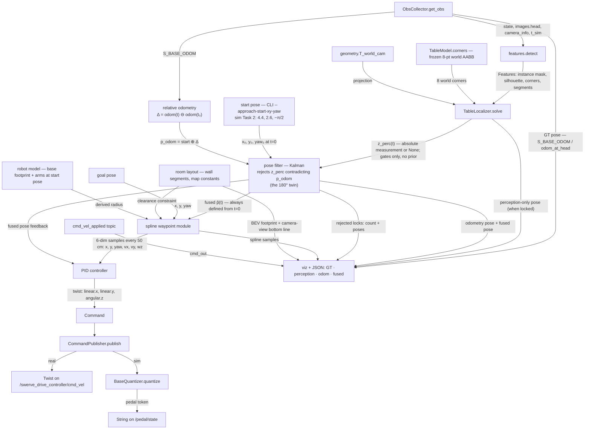
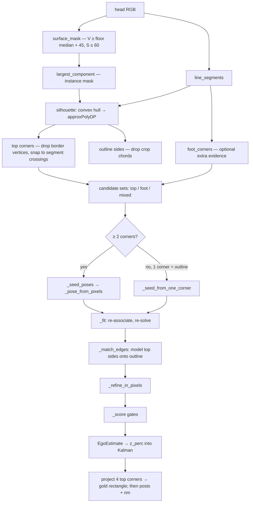

# Perception-based approach navigation

`--approach perception` replaces only **navigate**. Pose-based
`ApproachController` stays the default. Opt-in:

```bash
# Task 2 sim spawn — rough start for the pose filter (world x, y, yaw rad):
#   (4.4, 2.6, −π/2)  ≡  TASK2_SPAWN_XY_YAW
RUN_ARGS="--approach perception \
  --approach-start-xy-yaw 4.4,2.6,-1.5708 \
  --approach-dump outputs/approach/perception_N" \
  ./scripts/launch_policy.sh
# or: START_XY_YAW=4.4,2.6,-1.5708 with the same RUN_ARGS perception flags
```

The table is a **known map landmark**. Only ego `(x, y, yaw)` is unknown.
The 3D AABB is not fitted as eight free corners: the **tabletop rectangle**
is recovered in the image, then the known rigid model is projected through
the camera to place the box.

Everything under `camelo/control/perception/` is numpy + cv2 + PIL. The
controller (`camelo/control/approach_perception_based.py`) is only the FSM.

## 1. Architecture

`detect` → `solve` is gates-only and prior-free. The Kalman filter turns a
rough start + relative odometry + occasional vision locks into a continuous
fused pose that plan and PID always have from `t = 0`:



**Invariant:** the controller and the planner never wait on `solve`. The
filter is seeded with the start pose, so `p̂(t)` and the BEV trajectories
exist from the first tick; vision corrects when it locks, and relative
odometry carries the estimate between locks.

### 1.1 Gates only inside `solve`

`TableLocalizer.solve` takes no pose prior and never vetoes a fit on
distance-from-expected. The rough **start pose is not a `solve` prior** —
it is only a Kalman input (§1.2). Mirror ambiguity of the AABB is handled
by the gate stack alone (correspondences, reprojection RMS, edge support,
unexplained corners, tabletop IoU, recall, instance footprint); a mirrored
pose that clears every gate **will** be published as `z_perc`.

That is deliberate: `z_perc` is the honest perception-only channel, twins
and all. The twin is caught one layer later, by the filter (§1.2), where
odometry from a known start gives real evidence to reject it with. This is
MEASURED, not hypothetical — with the prior removed, the round-trip test at
(3.00, 3.20, −150°) returns the mirrored pose.

### 1.2 Kalman pose filter — start + relative odom + vision

`TableLocalizer.solve` never feeds the controller. Its output is an
optional measurement `z_perc(t)` into the filter. The controller consumes
only the filter's **fused** estimate `p̂(t)`.

| Channel | Symbol | Role |
|---|---|---|
| start pose | `(x₀, y₀, yaw₀)` | CLI `--approach-start-xy-yaw` (sim: Task 2 spawn). Seeds the filter at `t = 0`. |
| relative odometry | `p_odom(t) = start ⊕ (odom(t) ⊖ odom(t₀))` | Process / open-loop channel from live `S_BASE_ODOM`. |
| perception | `z_perc(t)` or `None` | Absolute landmark measurement when gates pass. |
| **fused** | **`p̂(t)`** | **What plan + PID + HUD drive on. Always defined once start is set.** |

Predict steps with the odometry increment since the previous tick.
Correct toward `z_perc` when present, at a gain computed per measurement
from its own fit evidence (`n_corr`, `residual_px`, `tabletop_iou` —
`filter._measurement_gain`) rather than one flat constant: a strong fit
pulls close to the measurement, a marginal one only nudges the estimate.
MEASURED (`outputs/approach_dump/2215` vs `1738`, replayed offline against
recorded dumps): a flat gain traded off "responsive when a lock is good"
against "safe when it isn't" — damping a marginal fit that produced a
2.33 m single-tick jump also muted every good correction in the
busiest recorded run. Quality-weighting instead cut that jump to 0.41 m
*and* improved the busiest run's rmse (0.227 m → 0.193 m).

**Mirror rejection.** A measurement whose position or yaw contradicts the
odometry-propagated estimate beyond a threshold is dropped rather than
fused. This is the old `PosePrior`'s job restored one layer later, and it
is defensible where the prior was not: it tests against measured odometry
from a known start, not against an assumption about where the robot ought
to be. Rejected locks are counted and written to the JSON sidecar with
their poses, so mirror-lock frequency is measurable instead of invisible.
The xy threshold (`REJECT_XY_M_DEFAULT`, 1.5 m) is the first line of
defense against a bad fit like the one above — it also bounds how far a
legitimate first lock can be from a rough CLI start pose (§1.1); a start
pose off by more than that now needs its first lock's yaw alone to
correct it.

Display / dump channels (JSON sidecar + BEV from `t = 0` where defined):

| Name | Source |
|---|---|
| GT | `S_BASE_ODOM` (image-stamped when available) — sim truth / rig odom |
| perception-only | last accepted `solve` / `align_edges`, or absent |
| odometry | `p_odom(t)` = start ⊕ relative |
| fused | `p̂(t)` |

Localization is never gated on vision lock. Optional table-seeking yaw,
if used at all, is a visual behaviour only — not how the pose estimate is
created.

### 1.3 Spline waypoint module

Fits a spline from the current fused pose to the goal pose, 6-dim per
sample:

| Component | Dims |
|---|---|
| position | `x`, `y`, `yaw` |
| velocity | linear `vx`, `vy`; angular `wz` |

Samples every **50 cm** along the path, visualized in both spaces:
projected into the head image through `T_world_cam`, and drawn in BEV.

**Inputs: fused pose, goal pose, and the room layout.** Clearance
constraint:

> the spline must not hit a wall or the table, with the robot modelled as a
> disc of `geometry.BASE_RADIUS_M` (0.468 m, §1.3.2) — every point on the
> fitted path clears every wall in `walls.ROOM_WALLS` and the table AABB
> (`planner.plan(table=…)`) by that radius, not just
> the sample points.

Room layout in both views:

- **BEV** — wall footprint (`viz.draw_bev` `walls` argument).
- **Camera view** — each wall's **bottom line** (floor/wall intersection at
  `z = 0`), projected like the table AABB. `viz.project_edge` clips to the
  near plane and the pixel rect.

#### 1.3.1 Room plan — `walls.py`

Map data, same role as `table.py` for the table:

| Constant | What |
|---|---|
| `TASK2_CUBICLE_WALLS` | 7 `WallSegment`s — partitions enclosing the Task 2 workspace |
| `ROOM_WALLS` | what the approach plans against (alias of the above) |
| `ROOM_BOUNDS_XY` | outer shell, x −12.49..12.51, y −7.51..7.49 (never binds; >6 m away) |

Cubicle interior: **x 0.24 → 5.49, y 0.34 → 3.54**, containing the table
(centre (2.05, 1.95)) and the spawn pose (4.4, 2.6). Each wall is a slab
**centreline** plus `thickness_m`; clearance wants
`BASE_RADIUS_M + thickness_m / 2` from the centreline.

`detect_walls` returns `[]` — a measured wall is different from a mapped
one; the planner uses the map only.

**Provenance.** Numbers come from `assets/robot_room.usd` via `pxr`
(`UsdGeom.BBoxCache`): floor-touching (z_min ≤ 0.20), ≥ 0.5 m tall, ≤ 0.35 m
thin in one horizontal axis and ≥ 0.40 m long in the other. Recipe in the
`walls.py` docstring. Asset frame = world frame
(`configure_robot_room_stage` at (0,0,0), identity root). Cross-check: Task 2
desk bounds x 1.44..2.69, y 1.60..2.34 match `TableModel` to ~1.5 cm; near
edge y=2.32 is the table AABB's +y face (`TableModel`), which the planner
keeps clear (§1.3).

#### 1.3.2 Robot model — `geometry.py`

From `camelo/control/assets/mobile_fr3_duo_v0_2_lula.urdf`:

| Constant | Value (m) | URDF source |
|---|---|---|
| `BASE_HALF_LENGTH_M` | 0.3807 | `front_` / `rear_mounting_point_joint` |
| `BASE_HALF_WIDTH_M` | 0.2727 | `left_` / `right_mounting_point_joint` |
| `BASE_RADIUS_M` | **0.468** | `hypot(0.3807, 0.2727)` |

**Base radius = clearance radius.** Arms reach ~1 m horizontally at spine
`SPINE_SOP_M` 0.50, but at z ≈ 1.0–1.5 m, clearing the 0.75 m table and
cubicle partitions (≥ 1.18 m). Floor clearance is a base problem; arm-height
collisions need the arm envelope separately.

Wall-face clearance vs 0.468 m radius along the nominal route:

| Point | (x, y) | Wall clearance | Margin |
|---|---|---|---|
| spawn | (4.40, 2.60) | 0.940 | +0.472 |
| transit | y = 2.95 | 0.590 | +0.122 |
| **goal** | **(2.10, 3.05)** | **0.490** | **+0.022** |

Goal margin (2.2 cm) is tighter than typical localization error — a few
centimetres of pose error can put the modelled base into the north
partition. Table AABB is x 1.425..2.675, y 1.580..2.320 (`TABLE_ORIGIN_XY`
is the centre). Link meshes extend past origins; arm figures are a lower
bound.

### 1.4 PID base control

PID on body-frame error against the current spline sample → continuous
twist:

```
msg.twist.linear.x  = x
msg.twist.linear.y  = y
msg.twist.angular.z = yaw
```

- **Sim wire** cannot carry a continuous twist. `/pedal/state` is a discrete
  token (`PEDAL_LINEAR_SPEED` 0.5 m/s, `PEDAL_ANGULAR_SPEED` 1.2 rad/s).
  Path: PID → `BaseQuantizer.quantize` (engage 0.5 / release 0.3) → token.
  Sim motion stays one-axis-at-a-time. Real wire
  (`/swerve_drive_controller/cmd_vel`) takes the twist as written.
- **`cmd_out`** is visualized: applied command topic
  (`/isaac/cmd_vel_applied` in sim, `/swerve_drive_controller/cmd_vel_out`
  on the rig) drawn beside the commanded twist.

### 1.5 Navigate stages

Spine hold → drive the spline on the fused pose → inherited `place_arms` /
`start_pose`. The finegrained trim stage is disabled for perception
(`finegrained_start_position=False`, unconditionally, hardcoded in
`PerceptionApproachController.__init__`): `place_arms` already keeps vision
alive via `align_edges`, so there is nothing left for a dedicated trim
stage to correct. Pose-based `ApproachController` (the default) keeps it.

The start pose seeds the filter; relative odometry keeps `p̂` current;
vision corrects when the table is in frame. Plan, PID, and dumps therefore
have trajectories from the first navigate tick (all four pose channels).

Spawn (4.4, 2.6) already has 0.47 m clearance past `BASE_RADIUS_M` — no
open-loop clear maneuver. Localization does not depend on yaw-search.

Shared with the rest of the stack: `features.detect`, `TableModel`,
projection geometry, the gate stack of §3.3, and `Command` →
`CommandPublisher` → wire.

## 2. Tick flow

| Stage | Behaviour |
|---|---|
| `spine` | Hold until measured spine ≥ SOP min for `spine_hold_ticks`. |
| `navigate` | Every tick: relative-odom predict into the filter; `solve` correct on a **new** head frame only (stamp-deduplicated — the collector hands out the latest frame every tick, ~10 ticks per frame at 20 Hz); refit the spline fresh from the fused pose to the goal; PID toward the fit's next sample (~50 cm ahead, or the goal itself on the final leg); settle at goal then advance stage. |
| `place_arms` | Inherited arm path; vision `align_edges` still updates the filter. |
| `start_pose` / `done` | Inherited handover — no finegrained trim stage (§1.5). |

Base command: PID twist → (sim) `BaseQuantizer` → pedal token, or (real)
twist on `cmd_vel`. Dump every tick: head overlay + BEV + JSON with GT,
perception-only, odometry, and fused.

## 3. How the 3D bbox is regressed

The unknown is the camera's pose in the room, not the table. The table's
world AABB is frozen (`origin (2.05, 1.95)`, size `(1.25, 0.74)`, height
`0.75 m`, yaw 0). Fitting ego `(x, y, yaw)` **is** placing that AABB in the
image: project `TableModel.corners()` through
`T_world_cam = T_world_base(x, y, yaw) @ T_base_cam(spine)`.

Evidence is the **tabletop rectangle**, not the legs. Overlay draws that
quad first (gold); remaining AABB edges (posts, bottom rim) are the same
rigid body extruded to `z = 0`.



### 3.1 Instance, not a colour blob

`surface_mask` is a cue. Pads and walls also look bright. `largest_component`
keeps one blob; `Features.surface` is that instance. When the table fills
the lower frame the floor sample *is* the table and the relative threshold
goes empty; then a high-V low-S absolute mask (V≥170) recovers the
instance. `silhouette` convex-hulls it so a gripper bite is not a tabletop
corner, then drops outline sides whose ends share one image border. A side
that spans opposite borders is the table rim leaving the frame.

### 3.2 Pixel-space pose (`_pose_from_pixels`)

Unprojecting a tabletop corner onto `z = 0.75` is ill-conditioned near the
horizon. The fit never uses that metric. For a **fixed yaw**, projection is
linear in base `(x, y)`:

```
u = fx · X/Z + cx   →   fx · X + (cx − u) · Z = 0
```

`X, Y, Z` are affine in `(x, y)` once yaw and the known world corner are
fixed. Sweep yaw at 4°, solve the 2-unknown least squares at each step,
pick the yaw by **reprojection** cost. Two assigned corners suffice to seed;
outline sides add line constraints of the same form. Gauss-Newton
(`_refine_in_pixels`) polishes `(x, y, yaw)` against pixel residual. Height
and edge lengths enter only as the rigid model — they are never free.

### 3.3 What a lock has to explain

Rank by `(-n_corr, unexplained, -tabletop_recall, -tabletop_iou,
-edge_support, residual)` so a one-edge
shift of the rectangle (perfect residual, wrong inliers) loses.

| Gate | Threshold | Why |
|---|---|---|
| correspondences | `n_corr ≥ 3` (matched edges are counted as `n_edges` but do not lower the bar) | two points determine a pose under *any* assignment |
| reprojection | RMS ≤ 30 px | the pixels it claims |
| edge support | ≥ 0.35 of predicted top outline on detected segments | vertices are not the only evidence |
| unexplained | ≤ 1 model corner well inside the frame with no detection | wrong assignments put extra corners in open view |
| tabletop IoU | ≥ 0.30 vs instance | two corners + two edges can still sit the top on empty floor |
| tabletop recall | ≥ 0.70 of the instance inside the projected top | known L×W cannot draw a box much smaller than the table |
| instance footprint | unprojected blob ≤ 1.25×0.74 plus `FOOTPRINT_MARGIN_M` 0.20 m slack per axis, on the table, height 0.75 m | a too-far pose spreads the same pixels past the table AABB |
| in view / in room | any projected corner near the frame; `(x, y)` in the room | `_table_in_view` uses corners, not the 3D centroid |

No distance-from-start veto inside `solve`. A measurement that clears the
gates is published as `z_perc` even if it is a 180° twin of the truth; the
Kalman fuse is where start + odometry can pull against it.

### 3.4 Drawing

Head overlay and BEV show the four pose channels from §1.2:

- **GT** — AABB / FOV from odom at the head-image stamp when available
  (violet). Display-only; sidecar `gt_from` is `"image"` when stamped.
- **Perception-only** — last accepted `z_perc` when present.
- **Odometry** — `p_odom = start ⊕ relative`.
- **Fused** — `p̂`; tabletop gold fill + est AABB when drawing the driven pose.

For the fused (or perception) box:

1. Rasterise the four top corners (`TOP_INDICES` 4–7), clip the quad to the
   near plane (`_visible_tabletop`), fill gold.
2. Draw the four top edges gold, width 3.
3. Draw the remaining AABB edges (posts, bottom) in box colour, width 2.

`project_edge` clips each 3D edge to the camera near plane, then Cohen–
Sutherland to the pixel rectangle. BEV trails for all four channels from
`t = 0`.

### 3.5 Camera model

`camera_sensors.yaml` documents the real ZED Mini as **90° × 60°**. The
Isaac `Camera` prim uses the USD default film (`focalLength` 18.14756 /
`horizontalAperture` 20.955) → **60° HFOV, square pixels** (`fx = fy ≈
1108` at 1280×720).

Live `K` comes from `/isaac/head_camera/camera_info` (BEST_EFFORT, same as
images). Offline tests and ticks before CameraInfo arrives fall back to the
60° square model. Distortion `D` is applied when non-zero; sim cameras are
ideal pinhole.

**Rig (no CameraInfo).** `--approach-profile configs/rig/perception_munich.yaml`
supplies a `CameraModel` (`perception/profile.py`) when nothing is
published: the ZED-M stream on `/head_camera/zed_node/rgb/color/rect/image`
is *unrectified* (station config) and shows barrel distortion — the
workbench's straight edges bow ~25 px. `k1 = −0.19` at the nominal 90° focal
length (self-calibrated from edge straightness on seven real frames,
2026-09-05) straightens them to < 1 px RMS; `undistort_scale = 0.85` keeps
the near corners inside the frame. Line straightness cannot determine `f`,
so the factory calibration replaces `fx, fy, cx, cy` before metric use.
The same profile sets `surface_v_abs = 145`: the white partitions behind
the table (V 92–133) pass the sim's floor-relative rule and fuse with the
tabletop (V 181–198); the absolute threshold separates them with zero wall
leakage. Live CameraInfo, if it ever appears, overrides the profile camera.

## Limitations

- **One known landmark, one room.** `TableModel` is a single frozen AABB.
  A different table or layout needs a new model and start pose, not a flag.
- **Start pose is operator-supplied.** A wrong `--approach-start-xy-yaw`
  biases `p_odom` and initial `p̂` until vision corrects; nothing checks
  that the start matches true spawn.
- **AABB 180° symmetry.** Gates-only `solve` can publish a mirror lock;
  start does not veto inside `solve`, only influences the fuse.
- **Sparse vision (~1.6 Hz) vs control (~50 Hz).** Between locks, `p̂`
  follows relative odometry; drift and a bad start show up in the
  GT-vs-fused dump channels.
- **Heuristic detection.** Brightness / Hough features, not learned; gates
  reject bad fits but cannot invent a missed table.
- **No live obstacle sensing.** Clearance is mapped walls + the table AABB + base radius.
- **Sim twist is quantized.** PID output hits the pedal wire through
  `BaseQuantizer` — one axis at a time at fixed speed.
- **CameraInfo bring-up.** Before the first info message, projection uses
  the 60° fallback intrinsic.
- **Task-tuned.** Gate thresholds, clearance numbers, and the default start
  are for this spawn/table/cubicle; a new layout re-derives them.
